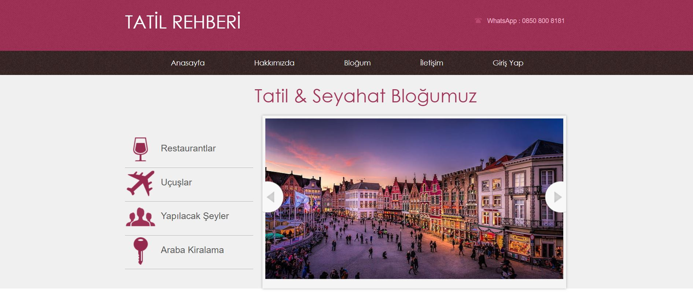
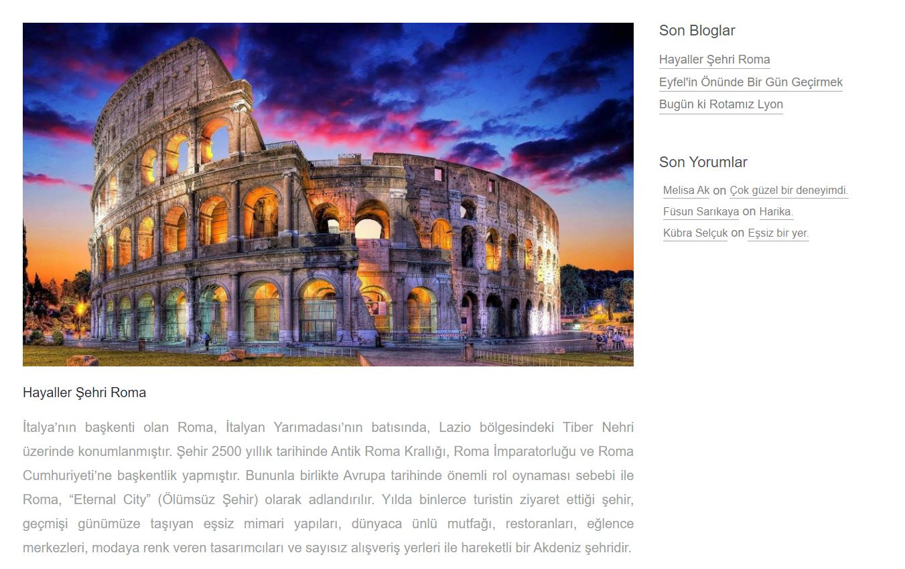
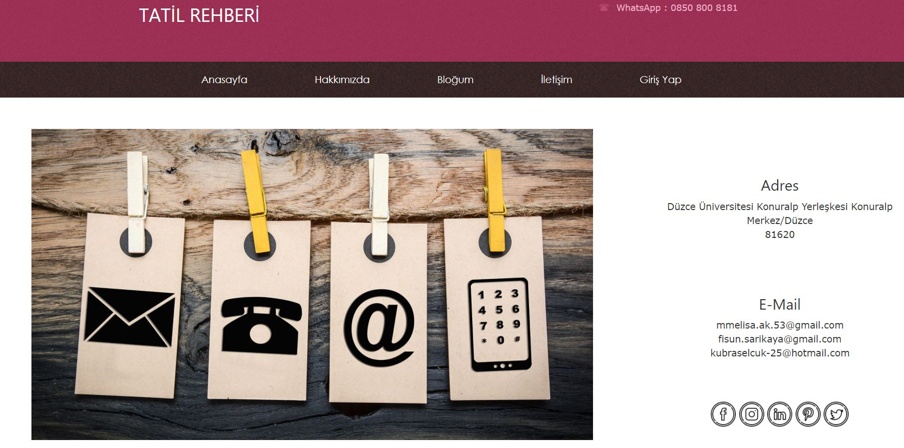

<html>
  
   <body>
      

         <h3 >Anasayfa</h3>
          
          
    

       
      

         <h3 >Hakkımızda</h3>
          
      

       
      

         <h3 >Bloğum</h3>
          
      

       
      

         <h3 >İletişim</h3>
          
      

       
      

         <h3 >Giriş Yap </h3>
          
      

       
      

         <h3 >Admin Yönetim Paneli</h3>
          
      

   </body>
</html>